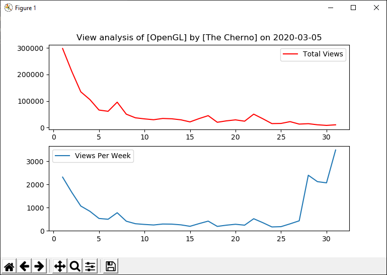

# Python Implementation

## Dependencies

Libraries used are [requests](https://requests.readthedocs.io/en/master/), [numpy](https://numpy.org/) and [matplotlib](https://matplotlib.org/).

## Usage

`python script.py <Playlist ID> <Google API Key>`

## Result Example

```
View analysis of [OpenGL] by [The Cherno] on 2020-03-05
index   views   views/wk
 1      298023  2317.96 
 2      212467  1665.47 
 3      134758  1068.30 
 4      105535  840.44  
 5      66092   530.56  
 6      61357   496.53  
 7      95840   778.28  
 8      50516   412.14  
 9      36883   303.39  
10      32826   272.25  
11      29610   248.53  
12      34388   290.02  
13      33165   285.55  
14      29295   254.42
15      21475   191.50
16      33929   308.05
17      44963   415.77
18      20019   187.85
19      25379   240.40
20      29110   279.52
21      24081   240.47
22      50647   519.08
23      33341   348.86
24      15059   164.45
25      15630   176.47
26      22452   298.22
27      13184   429.25
28      14738   2399.21
29      10610   2122.00
30      8281    2070.25
31      10469   3489.67
```

